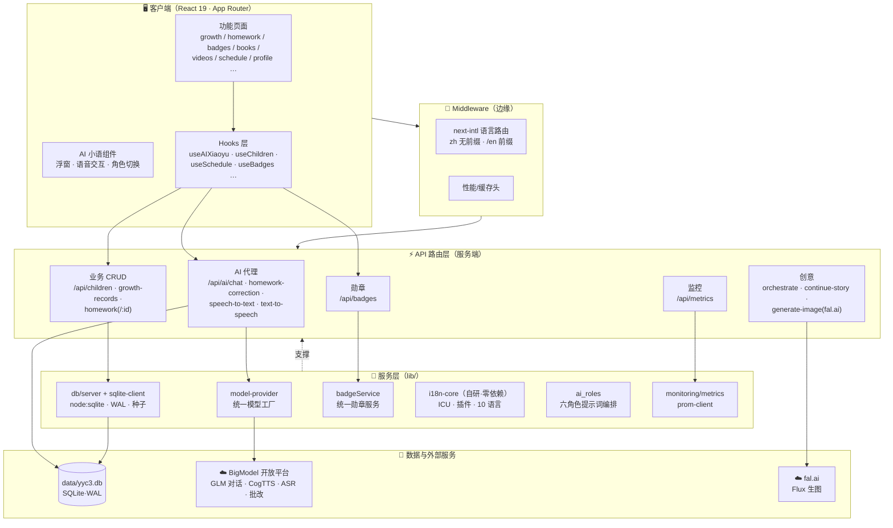
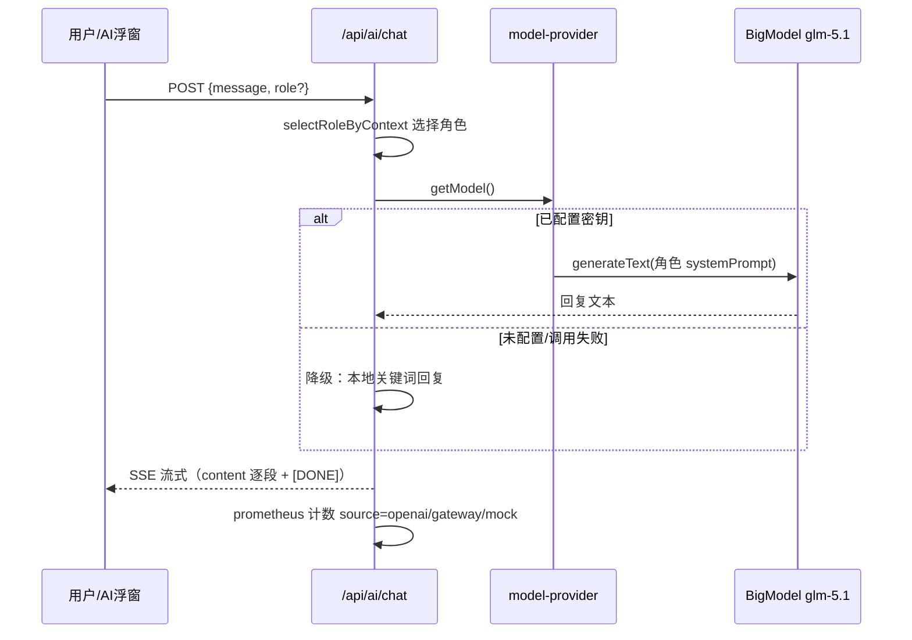
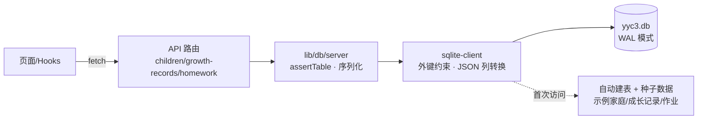
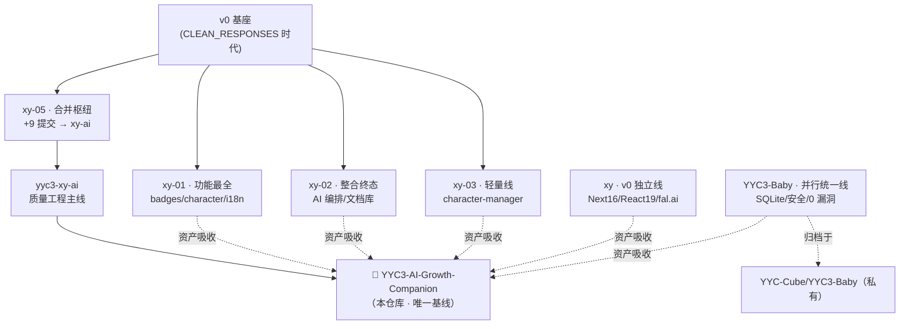

<div align="center">


# YYC³ AI小语 · 智能成长守护系统

**YYC³ AI Growth Companion — 0-22 岁全周期 AI 成长守护平台（统一合并版）**

[](https://github.com/YYC-Cube/YYC3-AI-Growth-Companion/actions/workflows/ci.yml)
[](#-质量基线)
[](https://github.com/YYC-Cube/YYC3-AI-Growth-Companion/security/dependabot)
[](https://nextjs.org/)
[](https://react.dev/)
[](https://www.typescriptlang.org/)
[](https://bun.sh/)
[](LICENSE)

本仓库是多版本家族收敛后的**唯一开发基线**：以 yyc3-xy-ai 演进线为主干，
吸收 xy-01/02/03/05、xy（v0 线）与 YYC3-Baby 并行统一线的全部有效资产。
</div>

---

## 📖 目录

- [能力总览](#-能力总览)
- [可视化架构](#-可视化架构)
- [快速开始](#-快速开始)
- [AI 能力与模型接入](#-ai-能力与模型接入)
- [数据层](#-数据层)
- [安全模型](#-安全模型)
- [国际化](#-国际化)
- [CI-CD 与质量基线](#-ci-cd-与质量基线)
- [目录结构](#-目录结构)
- [开发者指南](docs/developer-guide.md)

---

## ✨ 能力总览

| 能力 | 现状 | 说明 |
|---|---|---|
| 🗣️ AI 对话 | **真实 LLM 在线** | BigModel GLM 系列（glm-5.1），六大角色 systemPrompt 编排，SSE 流式；未配密钥自动降级本地回复 |
| 📝 作业批改 / 语音 | **服务端代理** | 图片批改、语音转写、语音合成（CogTTS）全走 API 代理，浏览器零密钥 |
| 💾 数据持久化 | **SQLite 真实落盘** | `node:sqlite` + WAL + 外键约束，children / growth-records / homework 真实 CRUD，重启不丢数据 |
| 🏅 勋章系统 | 统一实现 | 22 枚勋章、10 大套系、统计/搜索/解锁 API 与页面全通 |
| 🌐 国际化 | 双轨制 | App 路由用 next-intl v4（`/en` 前缀路由）；脚本/工具场景用自研零依赖 i18n-core（内置一方代码） |
| 📊 可观测性 | Prometheus | `/api/metrics` 暴露默认指标 + AI/徽章业务计数器 |
| 🔒 安全 | 纵深防御 | 密钥仅服务端、安全响应头全套、生产 CSP、依赖 0 告警 |
| 🤖 CI/CD | 单流水线双阶段 | 质量门禁（测试+构建阻塞）→ 生产冒烟（八项路由实测） |

---

## 🏗 可视化架构

### 系统分层总览



### AI 请求链路（以对话为例）



### 数据持久化链路



### 版本合并谱系（本仓库从何而来）



---

## 🚀 快速开始

```bash
# 1) 克隆 & 安装（国内网络必须走镜像）
git clone git@github.com:YYC-Cube/YYC3-AI-Growth-Companion.git
cd YYC3-AI-Growth-Companion
NPM_CONFIG_REGISTRY=https://registry.npmmirror.com bun install

# 2) 配置密钥（复制模板并按需填写）
cp .env.example .env.local
#   方式一（OpenAI 兼容）: OPENAI_API_KEY=sk-...
#   方式二（网关，如 BigModel）:
#     AI_API_KEY=你的密钥
#     AI_BASE_URL=https://open.bigmodel.cn/api/paas/v4
#     AI_MODEL=glm-5.1
#   作业批改/语音（服务端专用）: BIGMODEL_API_KEY=同一个密钥即可

# 3) 开发（端口 3201）
bun run dev

# 4) 验证
bun test            # 497 个用例
bun run build       # 生产构建
bun run start       # 生产模式（CSP 等安全头仅生产生效）
```

> SQLite 数据库 `data/yyc3.db` 首次访问 API 时自动建表并灌入种子数据，无需手动初始化。

---

## 🤖 AI 能力与模型接入

所有真实模型调用统一经 `lib/ai/model-provider.ts`（消除历史字符串 model 用法）：

| 场景 | 路由/模块 | 模型能力 | 降级行为 |
|---|---|---|---|
| AI 对话 | `/api/ai/chat` | GLM 对话 + 六角色 systemPrompt | 本地关键词回复（SSE 格式不变） |
| 多角色协同 | `/api/ai/orchestrate` | 复杂度分档协同 | 错误信息返回 |
| 故事续写 | `/api/ai/continue-story` | 创意生成 | 模板选项 |
| 评估报告 | `/api/ai/assessment-report` | 结构化报告 | 本地分析 |
| 作业批改 | `/api/ai/homework-correction` | 图片理解（10MB 上限） | 前端 Mock 数据 |
| 语音转写 | `/api/ai/speech-to-text` | ASR（25MB 上限） | 前端 Mock 文本 |
| 语音合成 | `/api/ai/text-to-speech` | CogTTS（音色白名单） | 静默失败 |
| 创意生图 | `/api/ai/generate-image` | fal.ai Flux + 儿童安全词过滤 | 占位 SVG |

推理模型说明：GLM-5 系列为推理模型（思考内容消耗同一 token 池），
对话路由 `maxOutputTokens` 已设 4096。

---

## 💾 数据层

- **引擎**：`node:sqlite`（Node ≥ 22.5），WAL 模式，外键约束开启
- **表**：users / children / growth_records / growth_assessments / homework / ai_conversations / badges / audit_log
- **约定**：JSON 列（media_urls、tags 等）由 server 层自动序列化；外键违规返回 400 + 中文提示
- **备份**：`VACUUM INTO`；`data/` 不入库（gitignore）
- 统一入口 `lib/db/server.ts`（listRows/createRow/getRow/updateRow/deleteRow + assertTable 白名单）

---

## 🔒 安全模型

1. **密钥边界**：所有 AI 密钥为服务端变量（`AI_API_KEY`/`OPENAI_API_KEY`/`BIGMODEL_API_KEY`），
   浏览器一律经代理路由访问；仓库内**禁止 `NEXT_PUBLIC_` 承载密钥**
2. **响应头**：nosniff / X-Frame-Options / Referrer-Policy / Permissions-Policy 全站生效
3. **CSP**（仅生产）：`connect-src` 限定 self + bigmodel；脚本/样式最小放行
4. **输入校验**：批改图片 10MB、音频 25MB、TTS 文本 2000 字上限 + 音色白名单
5. **依赖**：Dependabot 持续审计（当前 0 开放告警），overrides 引导传递依赖走修补版

---

## 🌐 国际化（双轨）

| 轨道 | 技术 | 适用 |
|---|---|---|
| 应用路由 | next-intl v4（middleware + `NextIntlClientProvider` + `i18n/request.ts`） | 页面文案，`/` 中文直出、`/en` 英文 |
| 通用运行时 | **自研 i18n-core**（`lib/i18n-core/`，零依赖一方代码） | 脚本/工具/非 React 场景：I18nEngine、ICU 编译器、插件系统、语言检测、RTL、10 种内置语言 |

```ts
// i18n-core 用法示例
import { I18nEngine, interpolate, formatRelativeTime } from '@/lib/i18n-core';
const engine = new I18nEngine({ locale: 'zh-CN' });
interpolate('你好 {name}', { name: '小语' });   // 插值
formatRelativeTime(-3600, 'zh-CN');              // 相对时间
```

---

## 🧪 CI/CD 与质量基线

单流水线（`.github/workflows/ci.yml`）：**质量门禁**（测试 + 生产构建，阻塞）→ **生产冒烟**
（干净 runner 上 `next start` 实测首页/SQLite/徽章/监控/AI 降级/安全头/i18n）；
类型检查与 lint 为报告项（存量基线见下）。

| 指标 | 当前值 | 说明 |
|---|---|---|
| 单元测试 | **497 通过 / 0 失败**（34 文件） | `bun test`，~4s |
| 依赖告警 | **0** | GitHub Dependabot |
| 类型债 | 778（已从 1214 降 36%） | 目标清偿后移除 `ignoreBuildErrors` |
| Lint 债 | 6711 | 存量，CI 报告项 |
| 冒烟 | 8 项路由实测 | CI smoke job |

---

## 📁 目录结构

```
├── app/                    # App Router（api/ 下 15 个路由 + 功能页面）
├── components/             # 业务组件（badge/growth/homework/ai-widget…）
├── lib/
│   ├── ai/model-provider   # 统一模型工厂（真实 AI 接入）
│   ├── db/                 # SQLite 数据层（server.ts 统一入口）
│   ├── i18n-core/          # 自研零依赖国际化（一方内置）
│   ├── data/               # 勋章数据源（32 徽章 10 套系）
│   └── monitoring/         # prom-client 指标
├── i18n/ · messages/       # next-intl v4 配置与中英文案
├── themes/                 # 三套 Figma 主题参考（未接线，tsc 排除）
├── docs/                   # 文档体系（01-规范 … 13-Baby并入文档）
│   └── developer-guide.md  # 开发者指南
├── __tests__/              # 497 用例
├── data/yyc3.db            # SQLite（gitignore，自动生成）
└── .github/workflows/ci.yml# 唯一 CI 流水线
```

---

## 📚 更多文档

- **[开发者指南](docs/developer-guide.md)** — 环境搭建、命令、密钥、架构、测试与排障（对齐项目实况）
- [合并执行报告](docs/12-归档文档/MERGE_EXECUTION_REPORT.md) — 三轮合并全记录
- [多版本深度分析与合并方案](../DEEP_CODE_ANALYSIS_AND_MERGE_PLAN.md) · [Baby 可并性分析](../YYC3-BABY_MERGEABILITY_ANALYSIS.md)

<div align="center">

**YYC³ · AI Growth Companion** · 统一基线 v3.x · MIT License

</div>
