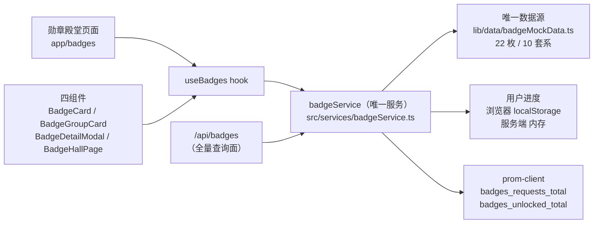
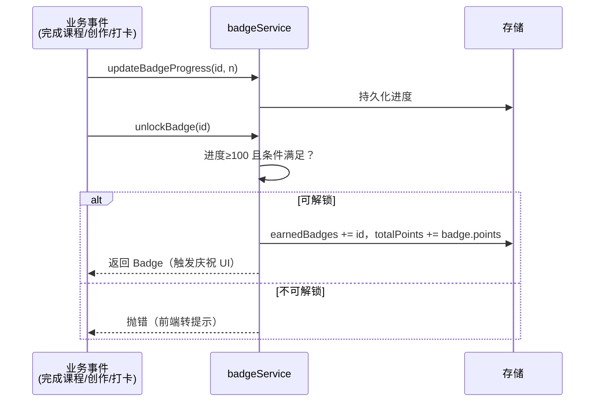

# 徽章系统设计（Badge System Design）

> **YanYuCloudCube ™**
> 言启象限 · 语枢未来 —— 万象归元于云枢，深栈智启新纪元

<div align="right"><sub>本文档为徽章域的权威设计说明，实况对齐 2026-08-19</sub></div>

---

## 目录

1. [系统定位](#1-系统定位)
2. [总体架构](#2-总体架构)
3. [数据模型](#3-数据模型)
4. [服务层设计](#4-服务层设计)
5. [API 设计](#5-api-设计)
6. [前端设计](#6-前端设计)
7. [解锁流程](#7-解锁流程)
8. [测试体系](#8-测试体系)
9. [扩展指南](#9-扩展指南)
10. [路线图](#10-路线图)

---

## 1. 系统定位

徽章系统是成长激励体系的核心载体：将学习/创作/文化探索等行为转化为
**可收集、可展示、可分享**的成就，服务于 0-22 岁全周期的正反馈循环。

**当前规模**（实测）：

| 指标 | 值 |
|---|---|
| 勋章总数 | **22 枚** |
| 套系 | **10 个**（growth 4 · creative 3 · hidden 3 · dynasty 3 · celebrities 2 · technology 2 · dream 2 · culture 1 · learning 1 · social 1） |
| 种子已获得 | 6 枚（850 积分） |
| 服务公开方法 | 22 个 |
| 测试用例 | 35 个（badgeService）+ API 实测 |
| 稀有度 | common / rare / epic / legendary / mythical |
| 等级 | bronze / silver / gold / platinum / diamond / legend |

## 2. 总体架构



**设计原则**（历史教训固化）：

1. **单一服务、单一数据源**：曾存在 src/ 与 lib/ 双服务并行（两套类型、两套
   数据），2026-08-18 统一。任何新能力进 `src/services/badgeService.ts`，
   数据变更进 `lib/data/badgeMockData.ts`，**禁止再建平行实现**
2. **类型单一来源**：`src/types/badge.ts` 重导出 `types/ui.ts` 规范类型 +
   勋章域扩展（BadgeFilter/BadgeUnlockEvent/BadgeUserProgress），
   禁止复制接口定义
3. **SSR 安全**：服务被 API 路由（服务端）与页面（浏览器）共同加载，
   localStorage 读写必须有 `typeof` 守卫
4. **相对导入**：数据源引用使用相对路径（CI 端 bun 别名解析差异）

## 3. 数据模型

### 3.1 核心实体（types/ui.ts + src/types/badge.ts）

```ts
interface Badge {
  id: string;                    // 如 'growth_bronze'
  title: string;                 // 如 '成长青铜'
  description: string;
  icon: string;                  // '/badges/<series>/<name>.png'（图标待产出，见 §10）
  series: BadgeSeries;           // 10 套系之一
  level: BadgeLevel;             // bronze…legend
  category: BadgeCategory;       // learning/culture/social/creative/physical/cognitive/emotional
  rarity: BadgeRarity;           // common…mythical
  unlockConditions: UnlockCondition[];  // 条件与进度
  earnedDate?: string;
  progress?: number;
  isHidden?: boolean;            // 隐藏勋章（达成前不可见详情）
  metadata: BadgeMetadata;       // points/version/createdAt/tags…
  nextBadge?: string;            // 套系内进阶链
  prerequisiteBadge?: string;    // 前置勋章
}

interface UnlockCondition {
  type: ConditionType;           // total_hours/consecutive_days/completed_courses/
                                 // cultural_sites_visited/interactions/creations/
                                 // score/perfect_score/streak/custom
  value: number;
  description: string;
}
```

### 3.2 数据文件结构（lib/data/badgeMockData.ts）

| 导出 | 内容 |
|---|---|
| `<series>Badges × 10` | 各套系勋章数组 |
| `allBadges` | 聚合数组（服务初始化来源） |
| `badgeGroups` | 套系元数据（名称/图标/徽标列表/分类） |
| `badgeStats` | 初始统计 |
| `earnedBadgeIds` | 种子已获得（6 枚） |
| `mockUserProgress` | 用户进度种子（统一合并时并入） |

### 3.3 套系语义

| 套系 | 定位 | 链路 |
|---|---|---|
| growth | 成长主线 | bronze→silver→gold→platinum 进阶链（prerequisiteBadge 串联） |
| creative | 创作激励 | 作品数驱动 |
| dynasty / celebrities / culture | 文化国学线 | 朝代/名人/文化探索 |
| technology / dream / learning / social | 兴趣与社交 | — |
| hidden | 彩蛋成就 | `isHidden`，达成前仅显示剪影 |

## 4. 服务层设计

`src/services/badgeService.ts`（单例，22 个公开方法）：

| 分组 | 方法 |
|---|---|
| 查询 | getAllBadges · getBadgeById · getBadgesBySeries/Category/Rarity/Level · getHiddenBadges · getEarnedBadges · getUnearnedBadges · searchBadges（含模糊匹配） |
| 过滤 | getBadgesByFilter（series/category/rarity/level/status/tags/points 区间/获得日期区间/搜索 组合过滤） |
| 统计 | getBadgeStats（bySeries/byCategory/byRarity/byLevel/totalPoints/recentBadges） · getBadgeGroups（含实时进度） · getSeriesProgress |
| 进度与解锁 | getBadgeProgress · updateBadgeProgress · isBadgeEarned · unlockBadge（异步） · getUnlockHistory |
| 用户数据 | resetUserProgress · exportUserProgress · importUserProgress |

**关键实现约束**：

- `loadStoredProgress/saveStoredProgress`：`typeof localStorage` 守卫，
  浏览器持久化 / 服务端内存降级，异常静默（隐私模式兼容）
- `checkUnlockConditions`：**进度达 100 是必要条件**（`updateBadgeProgress`
  驱动），条件值当前 Mock 为满足；接真实数据源后替换为统计查询
- 解锁事件追加 `unlockHistory` 并写存储；`unlockBadge` 对已获得返回 null、
  不存在抛错、条件不满足抛错（调用方捕获转 4xx/提示）

## 5. API 设计

`GET /api/badges`（详见 [api-reference.md](api-reference.md#勋章)）：

| 参数 | 行为 |
|---|---|
| `id=` | 单枚详情（404） |
| `action=search&q=` | 搜索 |
| `series=` / `category=` | 筛选 |
| `action=earned/hidden/stats/groups` | 聚合视图 |
| `action=progress&series=` | 套系进度 |

`POST /api/badges`：`{action:'unlock', id}` 解锁。

埋点：`badges_requests_total{action}` 与 `badges_unlocked_total`
（解锁成功时递增）。

## 6. 前端设计

| 组件（src/components/badge/） | 职责 |
|---|---|
| `BadgeHallPage` | 勋章殿堂主页面（统计卡 + 分组浏览 + 筛选） |
| `BadgeGroupCard` | 套系卡片（进度条/已获数） |
| `BadgeCard` | 单枚勋章（稀有度样式/进度） |
| `BadgeDetailModal` | 详情弹窗（条件清单/解锁动画占位） |

- 入口：`app/badges/page.tsx`（需先有儿童档案，`useChildren` 门控）；
  底部导航「勋章」tab；UserCenter 菜单「成长徽章」
- 数据流：`useBadges` hook → 服务实例 → 组件单向渲染
- 样式：CSS Modules 风格独立文件；颜色遵循
  [UI 一致性规范](standards/UI-Consistency-Guidelines.md)

## 7. 解锁流程



> 当前业务事件（课程完成等）尚未接 `updateBadgeProgress`——接线的
> 优先级与方案见 §10。

## 8. 测试体系

`__tests__/badgeService.test.ts`（35 用例，CI 阻塞门禁）覆盖：
查询/多维过滤/统计/进度更新/解锁成功与失败路径/历史/导入导出/重置。
约定见 [testing.md](testing.md)（bun:test、异步断言必须 await、SSR 守卫）。

## 9. 扩展指南

**新增一枚勋章**：

1. `lib/data/badgeMockData.ts` 对应套系数组追加（保持 id 规约
   `<series>_<name>`；进阶链补 prerequisiteBadge/nextBadge）
2. 如为新套系：追加数组 + badgeGroups 元数据 + `types/ui.ts` 的
   BadgeSeries 联合类型
3. `bun test __tests__/badgeService.test.ts` 回归；API 冒烟
   `curl 'localhost:3201/api/badges?action=search&q=新勋章'`

**新增统计维度**：`getBadgeStats` 扩展字段 → `BadgeStats` 类型 →
BadgeHallPage 统计卡 → api-reference.md 同步。

## 10. 路线图

| 优先级 | 项 | 说明 |
|---|---|---|
| P0 | **图标资产产出** | `/badges/**.png`（22 枚 × 5 稀有度样式可复用着色）在全家族从未产出，页面现为降级渲染；放入 `public/badges/<series>/` 即自动生效 |
| P1 | **业务事件接线** | 课程完成/创作提交/连续打卡等调用 `updateBadgeProgress`，解锁由真实行为驱动 |
| P1 | **持久化升级** | SQLite `badges` 表已在 schema 中预留——服务增加 SQLite 适配层（参考 `lib/db/server.ts` 模式），localStorage 降级为离线缓存 |
| P2 | 解锁庆祝动画 / 分享卡 | unlockAnimation/soundEffect/shareContent 字段已建模 |
| P2 | 反作弊与幂等 | 解锁事件审计（audit_log 表已预留） |

---

<div align="center">

**YanYuCloudCube ™** · YYC³ AI小语 · 智能成长守护系统

</div>
