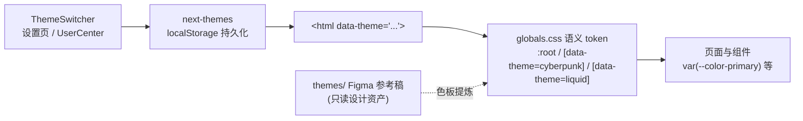

# 主题系统规范（Theme System）

> **YanYuCloudCube ™** · v3.3 · 2026-08-19
> 统一整合三套 UI 主题：default 暖阳 / cyberpunk 赛博霓虹 / liquid 液态翡翠

## 1. 架构



| 层 | 文件 | 职责 |
|---|---|---|
| Token | `app/globals.css` | **唯一色彩来源**：语义变量三套覆盖 |
| Provider | `components/theme-system/ThemeProvider.tsx` | next-themes 封装，`attribute="data-theme"`，导出 `THEME_IDS/THEME_META` |
| 切换器 | `components/theme-system/ThemeSwitcher.tsx` | 三选一胶囊（compact 模式用于菜单） |
| 接线 | `app/layout.tsx`（ThemeSystemProvider）· `app/settings`（外观区块）· `UserCenter`（下拉入口） | |
| 参考 | `themes/`（cyberpunk/liquid/default 三套 Figma 组件稿） | 设计资产，不入编译（tsconfig exclude） |

## 2. 主题规格

### default · 暖阳（默认）

| Token | 值 | 说明 |
|---|---|---|
| `--bg-app` | `#fffbeb` | 页面底（amber-50，与存量页面一致） |
| `--bg-surface` / `--bg-surface-soft` | `#ffffff` / `#fef3c7` | 卡片 / 柔和底 |
| `--fg-default` / `--fg-muted` | `#1f2937` / `#6b7280` | 主文字 / 次文字 |
| `--theme-accent` | `#f59e0b` | 主题特征色（琥珀） |

品牌色（primary 蓝、success/warning/error）沿用 `:root` 既有定义。

### cyberpunk · 赛博霓虹（提炼自 themes/cyberpunk）

深色底霓虹：`--bg-app #0a0a0f` · `--bg-surface #12121c` · primary `#00f0ff`（霓虹青）·
secondary `#ff2d95`（品红）· `color-scheme: dark`。

### liquid · 液态翡翠（提炼自 themes/liquid）

清爽玻璃感：`--bg-app #f0fdf9` · `--bg-surface-soft #ccfbf1` · primary `#10b981`（翡翠）·
secondary `#14b8a6`（teal）。

## 3. 使用规范

**组件取色一律用语义 token**（禁止新代码硬编码十六进制色——ESLint 自定义规则
`no-hardcoded-colors` 已存在）：

```tsx
<div className='bg-[var(--bg-surface)] text-[var(--fg-default)] border-[var(--border-soft)]'>
```

**JS/TS 中读取主题**：`useTheme()`（next-themes）或 `THEME_META`（图标/文案）。

**新增主题四步**：

1. `globals.css` 追加 `[data-theme='<id>']` token 块
2. `ThemeProvider.tsx` 的 `THEME_IDS`/`THEME_META` 注册
3. 需要表面接管时补充属性选择器覆盖
4. 本文档 §2 补规格行

## 4. 历史清理记录（本次统一整合）

| 移除项 | 原因 |
|---|---|
| `components/material/`（MUI 全家）+ `@mui/@emotion` 依赖 | 全局挂载但零真实消费（唯一引用是示例页），默认蓝主题与项目无关 |
| `components/theme-provider.tsx` / `yyc3-theme-provider.tsx` | 两个 next-themes 封装**均未被 layout 挂载**的死代码，后者还注入 foundation 旧 token |
| `themes/*/ThemeContext.tsx` 模式 | 双主题 localStorage 私有键（xy-theme）——其**色板**已提炼进 token 层，组件稿保留为参考 |

## 5. 路线图

1. **表面全面 token 化**：存量页面大量 Tailwind 浅色类（bg-amber-50 等）目前靠
   属性选择器有限覆盖；按页面逐步替换为 `var(--bg-*)`
2. 生日主题（components/theme/）纳入主题系统作为"时效主题"（生日当天自动启用）
3. dark 模式独立维度（当前三主题各自内定明暗）
